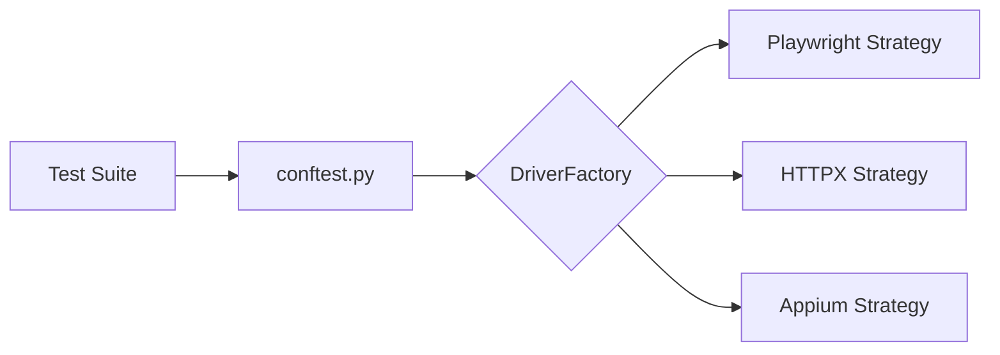

# TAFLEX PY Modular

[](https://github.com/vinipx/taflex-python-modular/actions/workflows/ci.yml)
[](https://vinipx.github.io/taflex-python-modular/)
[](https://www.python.org/downloads/release/python-3100/)
[](https://opensource.org/licenses/MIT)
[](https://github.com/astral-sh/ruff)
[](https://playwright.dev/python/)
[](https://www.python-httpx.org/)
[](https://appium.io/)
[](https://pact.io/)
[](https://github.com/pytest-dev/pytest-bdd)

**TAFLEX PY** is a high-performance, enterprise-grade test automation framework built on Python, designed for unified orchestration across **Web, API, Mobile, Contract, and BDD (pytest-bdd)** testing.

By leveraging the **Strategy Pattern** and a modular architecture, TAFLEX PY allows teams to write tests once and execute them across multiple platforms and environments with zero code changes.

---

## 🚀 Key Features

- **Unified Driver Interface**: Single `driver` fixture for Playwright (Web), HTTPX (API), and Appium (Mobile).
- **Behavior-Driven Development (BDD)**: Native Gherkin support via `pytest-bdd` integration.
- **Enterprise Documentation**: Interactive, built-in MkDocs (Material theme) with automated CI/CD deployment.
- **Smart Scaffolding**: Interactive CLI wizard to generate lightweight, bespoke projects tailored to your tech stack.
- **Pact Contract Testing**: Full support for Consumer-Driven Contracts (compatible with `pact-python` v2 and v3+).
- **Hierarchical Locators**: Externalized JSON-based locator management with Global -> Mode -> Page inheritance.
- **AI-Ready (MCP)**: Built-in Model Context Protocol server, enabling AI agents to debug and run tests autonomously.
- **Cloud Grid Integration**: Native support for BrowserStack and SauceLabs.

---

## 🛠️ Quick Start

### 1. Installation
TAFLEX PY requires **Python 3.10+**.

```bash
# Clone the repository
git clone https://github.com/vinipx/taflex-python-modular.git
cd taflex-python-modular

# Run the automated setup script
./init.sh
source .venv/bin/activate
```

### 2. Project Scaffolding
Create a new, clean automation project using the interactive wizard:

```bash
./scaffold.sh
```
The wizard will ask which modules (Web, API, Mobile, Contract, BDD) and reporters (Allure, ReportPortal, Xray) you need, then generate a ready-to-run project directory.

### 3. Running Tests
```bash
# Run all tests
pytest

# Run tests with a specific marker
pytest -m web
pytest -m bdd
```

---

## 🧪 Quality Assurance & Code Checks

TAFLEX PY enforces high code quality and maintainability standards. It includes a built-in `./codechecks.sh` script that validates both the architecture and the test coverage of the framework.

- **Architecture (Maintainability Index)**: Evaluated using [Radon](https://radon.readthedocs.io/), ensuring the codebase remains clean, readable, and easy to maintain over time.
- **Code Coverage**: Measured using `pytest-cov`, verifying that core framework utilities and implementations are thoroughly tested.

These checks are integrated into our scaffolded projects by default and run automatically as part of the **CI pipelines** (GitHub Actions & GitLab CI) to guarantee quality on every commit and pull request.

To run the checks locally:
```bash
./codechecks.sh
```

---

## 🤖 AI-Agent Integration (MCP)

TAFLEX PY includes a built-in **Model Context Protocol (MCP)** server, transforming your test automation framework into an active service that AI agents (like Claude Desktop, Cursor, or specialized CI/CD agents) can securely interact with.

- **Introspect Configuration**: Agents can read the JSON schema of your configuration and current environment state.
- **Execute Tests**: Agents can trigger `pytest` executions and analyze standard output/errors to autonomously debug failures.
- **Scaffold & Maintain**: Agents can read documentation, scaffold new test suites, and write test files natively.

To start the MCP server manually (or point your AI IDE to this command):
```bash
# Within your virtual environment
taflex-mcp
```
For full configuration details with Claude Desktop or Cursor, see the [MCP Integration Guide](docs/guides/mcp-integration.md).

---

## 📚 Documentation

TAFLEX PY comes with comprehensive documentation.

- **Local Preview**: Run `./docs.sh` to start the local MkDocs server at `http://localhost:8000`.
- **Online Version**: [View the latest documentation here](https://vinipx.github.io/taflex-python-modular/).

---

## 🧩 Architecture

The framework follows a modular strategy where the `DriverFactory` resolves the correct automation engine at runtime based on your `.env` configuration or Pytest markers.



---

## 🤝 Contributing

We welcome contributions! Please see our [Contributing Guidelines](docs/contributing/guidelines.md) for more details.

---

## 📄 License

This project is licensed under the MIT License.
