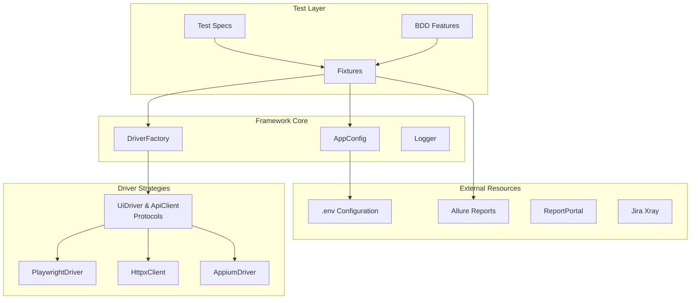
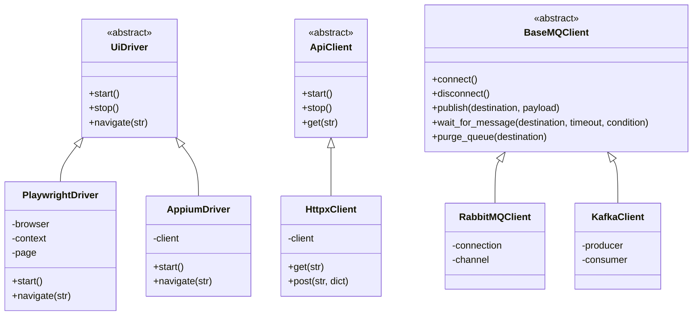
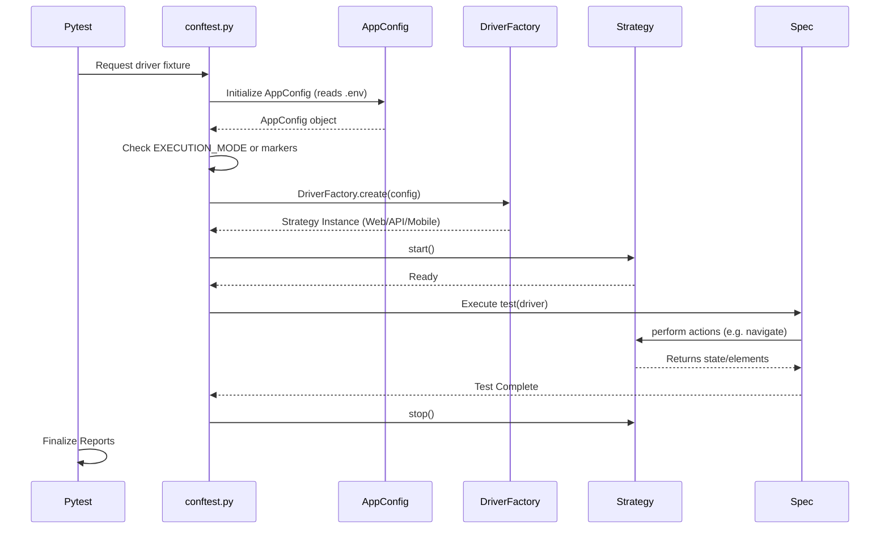

# Architecture Overview

TAFLEX PY is built on a robust, extensible architecture that follows enterprise-grade design patterns. This document explains the architectural decisions and how different components interact.

## Design Philosophy

TAFLEX PY follows these core principles:

| Principle | Description |
|-----------|-------------|
| **🧩 Strategy Pattern** | Runtime driver resolution allows the same test code to run on Web, API, or Mobile without modification. |
| **📄 Separation of Concerns** | Test logic is completely decoupled from driver implementation and locator definitions. |
| **⚙️ Configuration Over Code** | Behavior is controlled through external configuration, not hardcoded values. |
| **🧪 Fast Feedback Loop** | High-performance execution using Playwright and Pytest for rapid development. |

## High-Level Architecture



## Component Breakdown

### 1. Driver Layer

The Driver Layer implements the **Strategy Pattern**, allowing runtime selection of the appropriate driver implementation.



**Key Benefits:**
- ✅ Single test codebase for all platforms.
- ✅ Driver changes (e.g., swapping engines) don't affect test specs.
- ✅ Independent clients (like `BaseMQClient`) can be injected alongside UI/API drivers for asynchronous backend validation.
- ✅ Supports parallel execution with different strategies.

### 2. Configuration Management

The **AppConfig** (via Pydantic Settings) provides centralized access to validated environment variables:

```python
from taflex.core.config.app_config import AppConfig

# Type-safe access with Pydantic validation
config = AppConfig()
browser = config.browser
timeout = config.timeout_ms
```

### 3. Test Execution Flow



## Technology Stack

| Category | Technologies |
|----------|-------------|
| **Core Framework** | Python 3.10+, Pydantic, Pytest |
| **Web Testing** | Playwright, Chromium/Firefox/WebKit |
| **BDD Testing** | Gherkin, pytest-bdd |
| **API Testing** | Playwright (Hybrid) · HTTPX (Specialized) |
| **Mobile Testing** | Appium |
| **Message Queue** | RabbitMQ (pika), Kafka (confluent-kafka) |
| **Unit Testing** | Pytest |
| **Database** | SQLAlchemy, psycopg2, PyMySQL |
| **Reporting** | Allure, Playwright HTML |

## Extensibility Points

TAFLEX PY is designed for extension at multiple levels:

### 1. Custom Driver Strategies
Simply extend the `UiDriver` or `ApiClient` base classes and register it in the `DriverFactory`.

### 2. Custom Element Wrappers
Extend or create new element wrappers to support unique platform interactions while maintaining a consistent API.

### 3. Fixtures
Customize Playwright fixtures in `conftest.py` to inject global setup/teardown logic or custom dependencies.
